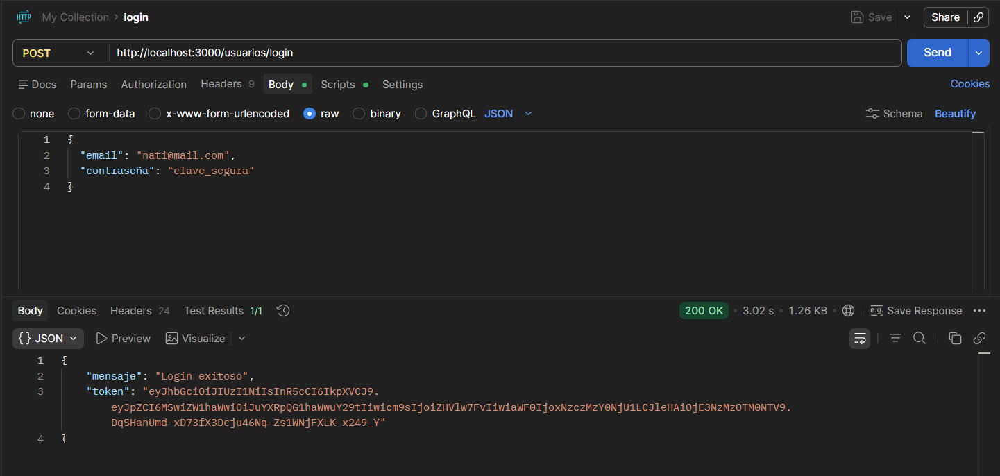

# 🍼 Pañalera Backend + QA

Proyecto académico/práctico de backend para la gestión de una pañalera.  
Incluye autenticación con JWT, control de roles (cliente/dueño), validaciones de stock y cantidad, y documentación QA con casos de prueba y evidencias.

---

## 🚀 Tecnologías utilizadas
- **Node.js + Express** → servidor backend
- **PostgreSQL** → base de datos
- **JWT (jsonwebtoken)** → autenticación y control de acceso
- **dotenv** → gestión de variables de entorno
- **Postman** → pruebas de endpoints
- **GitHub** → portafolio y documentación

---

## 📂 Estructura del proyecto
pañalera-backend/
│
├── controllers/        # Lógica de negocio
├── models/             # Acceso a base de datos
├── middlewares/        # Autenticación y roles
├── routes/             # Endpoints
├── test_QA/            # Documentación y evidencias QA
│   ├── RegistroPruebas_QA.csv
│   ├── documentos/
│   │   ├── CasosPrueba.md
│   │   ├── PlanPruebas.md
│   │   ├── Incidentes.md
│   │   ├── Informes.md
│   │   ├── PasosPrueba.md
│   │   └── DiseñoPruebas.md
│   └── evidencias/
│       ├── cp-login-001.png
│       ├── cp-ped-001.png
│       └── ...
├── index.js            # Punto de entrada del servidor
└── README.md           # Este archivo


---

## 📊 Documentación QA
- [Registro de Pruebas QA (CSV)](test_QA/RegistroPruebas_QA.csv)  
- Documentos de QA en `test_QA/documentos/` (casos de prueba, plan de pruebas, incidentes, informes).  
- Evidencias gráficas en `test_QA/evidencias/`.

Ejemplo de evidencia:



---

## ✅ Validaciones implementadas en `crearPedido`
- Producto inexistente → error 400  
- Stock insuficiente → error 400  
- Cantidad igual a 0 → error 400  
- Cantidad negativa → error 400  
- Body vacío → error 400  

---

## 📌 Cómo correr el proyecto
1. Clonar el repositorio:
   ```bash
   git clone https://github.com/natifrancese2023-prog/panalera-backend.git

Instalar dependencias:
npm install
Configurar variables de entorno en .env:
JWT_SECRET=PaNaLeRa!2026$ClaveSegura
DB_HOST=localhost
DB_USER=postgres
DB_PASSWORD=tu_clave
DB_NAME=pañalera

Iniciar servidor:
npm run dev

✨ Autor
Nati – Estudiante avanzada de Analista en Sistemas, enfocada en QA y Backend.
Este proyecto forma parte de su portafolio académico y profesional.