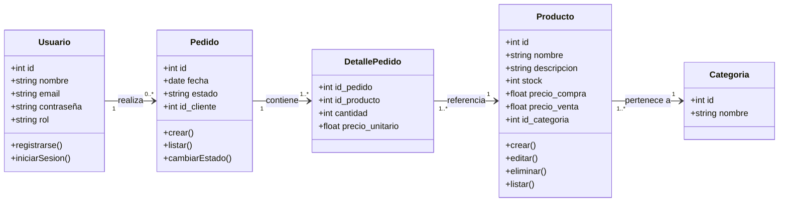
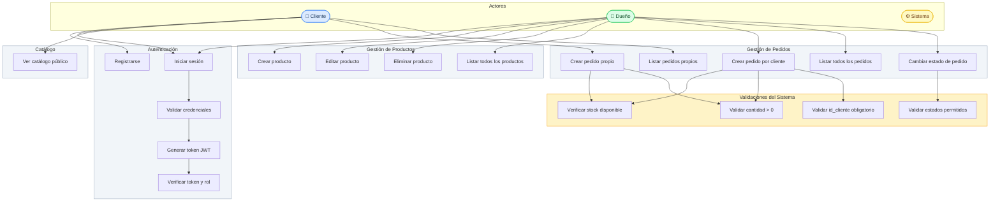

# Requerimientos Funcionales — Backend Pañalera

> **Proyecto:** Sistema de gestión de pañalera (backend)
> **Fecha:** 14 de marzo de 2026
> **Versión:** 1.0

---

## Índice

1. [Requerimientos Funcionales Globales](#1-requerimientos-funcionales-globales)
2. [Requerimientos Funcionales Detallados](#2-requerimientos-funcionales-detallados)
   - [2.1 Autenticación](#21-autenticación)
   - [2.2 Usuarios](#22-usuarios)
   - [2.3 Productos](#23-productos)
   - [2.4 Pedidos](#24-pedidos)
3. [Diagrama de Clases (UML)](#3-diagrama-de-clases-uml)
4. [Diagrama de Casos de Uso (UML)](#4-diagrama-de-casos-de-uso-uml)

---

## 1. Requerimientos Funcionales Globales

El sistema debe proveer una API REST que permita la gestión integral de una pañalera, contemplando los siguientes módulos principales:

- **Autenticación:** El sistema debe permitir el inicio de sesión seguro mediante JWT, con validación de roles y control de expiración de tokens.
- **Usuarios:** El sistema debe permitir el registro, autenticación y gestión de usuarios con roles diferenciados (`cliente` y `dueño`).
- **Productos:** El sistema debe permitir la gestión completa del catálogo de productos, incluyendo operaciones CRUD y exposición de un catálogo público filtrado por disponibilidad de stock.
- **Pedidos:** El sistema debe permitir la creación y seguimiento de pedidos, aplicando validaciones de negocio sobre stock, cantidades y estados permitidos, con vistas diferenciadas según el rol del usuario.

---

## 2. Requerimientos Funcionales Detallados

### 2.1 Autenticación

- El sistema debe permitir el inicio de sesión mediante credenciales (email y contraseña).
- El sistema debe generar un token JWT firmado al autenticar exitosamente a un usuario.
- El sistema debe incluir en el payload del token el identificador del usuario y su rol.
- El sistema debe validar el token JWT en cada endpoint protegido antes de procesar la solicitud.
- El sistema debe rechazar solicitudes con tokens expirados, malformados o ausentes, retornando `401 Unauthorized`.
- El sistema debe restringir el acceso a recursos según el rol declarado en el token (`cliente` o `dueño`), retornando `403 Forbidden` ante accesos no autorizados.

---

### 2.2 Usuarios

- El sistema debe permitir el registro de nuevos usuarios con los campos: nombre, email, contraseña y rol.
- El sistema debe encriptar la contraseña antes de almacenarla en la base de datos.
- El sistema debe impedir el registro de dos usuarios con el mismo email, retornando un error descriptivo.
- El sistema debe asignar por defecto el rol `cliente` si no se especifica uno durante el registro.
- El sistema debe permitir el inicio de sesión de usuarios registrados, validando email y contraseña.
- El sistema debe diferenciar el comportamiento de la API según el rol del usuario autenticado:
  - **Cliente:** acceso a catálogo, creación y consulta de sus propios pedidos.
  - **Dueño:** acceso completo a productos, todos los pedidos y cambio de estados.

---

### 2.3 Productos

- El sistema debe permitir al **dueño** crear nuevos productos con los campos: nombre, descripción, stock, precio de compra, precio de venta y categoría.
- El sistema debe permitir al **dueño** editar cualquier atributo de un producto existente.
- El sistema debe permitir al **dueño** eliminar un producto del sistema.
- El sistema debe permitir al **dueño** consultar el listado completo de productos, incluyendo aquellos sin stock.
- El sistema debe exponer un endpoint público (`GET /productos/catalogo`) que retorne únicamente los productos con `stock > 0`, incluyendo el campo `precio_venta`.
- El sistema debe retornar `404 Not Found` al intentar operar sobre un producto inexistente.

---

### 2.4 Pedidos

**Creación de pedidos:**

- El sistema debe permitir al **cliente** autenticado crear un pedido con uno o más productos, indicando la cantidad por ítem.
- El sistema debe permitir al **dueño** crear un pedido en nombre de un cliente, siendo obligatorio especificar el campo `id_cliente`.
- El sistema debe rechazar la creación de un pedido si el **dueño** no incluye `id_cliente`, retornando `400 Bad Request` con el mensaje `"Debe especificar id_cliente"`.
- El sistema debe rechazar pedidos con `cantidad <= 0`, retornando `400 Bad Request` con el mensaje `"La cantidad debe ser mayor a 0"`.
- El sistema debe verificar el stock disponible de cada producto antes de confirmar un pedido. Si la cantidad solicitada supera el stock, debe retornar `400 Bad Request` con el mensaje `"Stock insuficiente"`.
- El sistema debe registrar el pedido con estado inicial `pendiente` y la fecha de creación.

**Consulta de pedidos:**

- El sistema debe permitir al **cliente** listar únicamente sus propios pedidos.
- El sistema debe permitir al **dueño** listar todos los pedidos registrados en el sistema.
- El sistema debe retornar `404 Not Found` al intentar acceder a un pedido inexistente.

**Cambio de estado:**

- El sistema debe permitir al **dueño** cambiar el estado de un pedido.
- El sistema debe restringir los valores de estado permitidos a: `pendiente`, `confirmado`, `entregado` y `cancelado`.
- El sistema debe rechazar cualquier valor de estado fuera del conjunto permitido, retornando `400 Bad Request` con el mensaje `"Estado inválido"`.

---

## 3. Diagrama de Clases (UML)

---

## 4. Diagrama de Casos de Uso (UML)

---

*Documentación de requerimientos funcionales — Backend Pañalera — v1.0*
